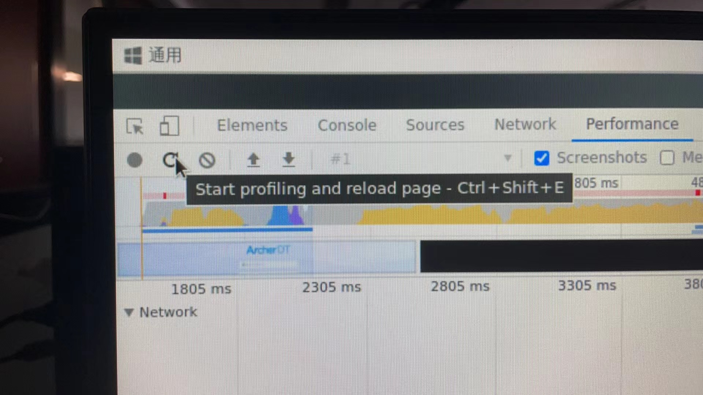
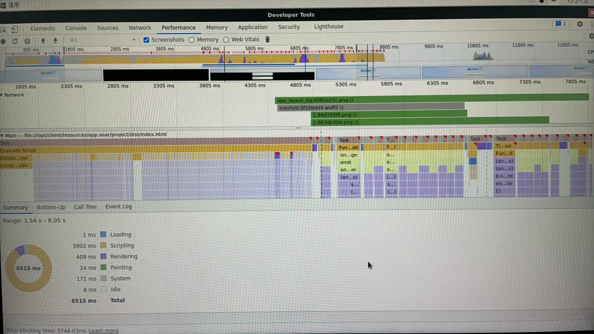
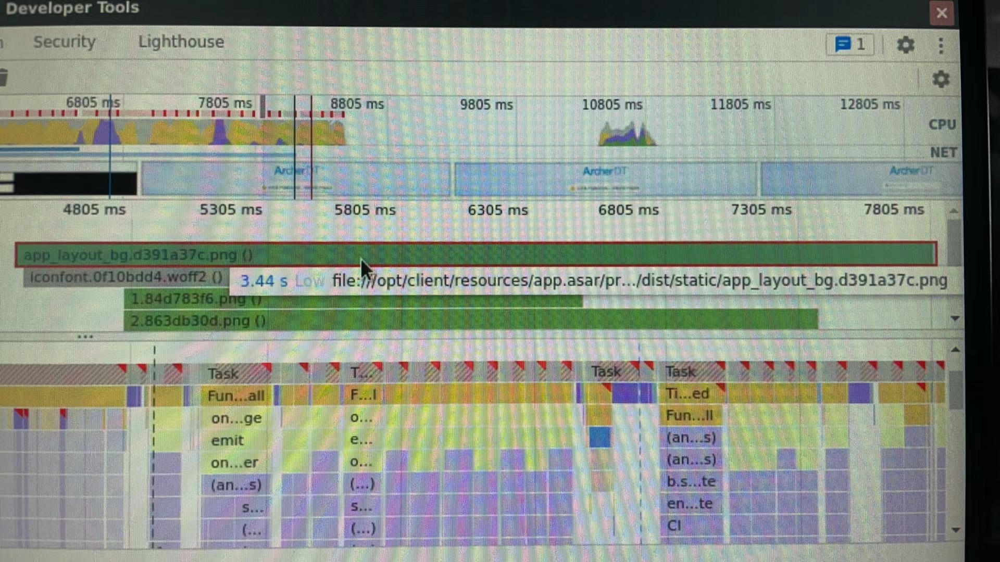
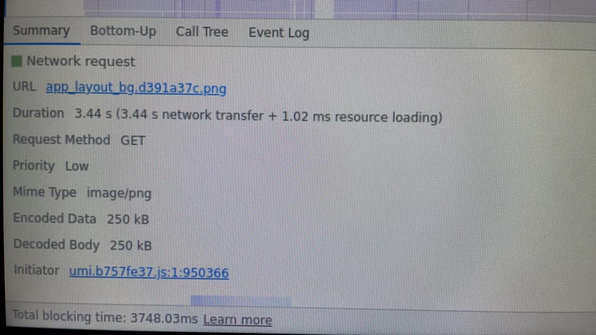
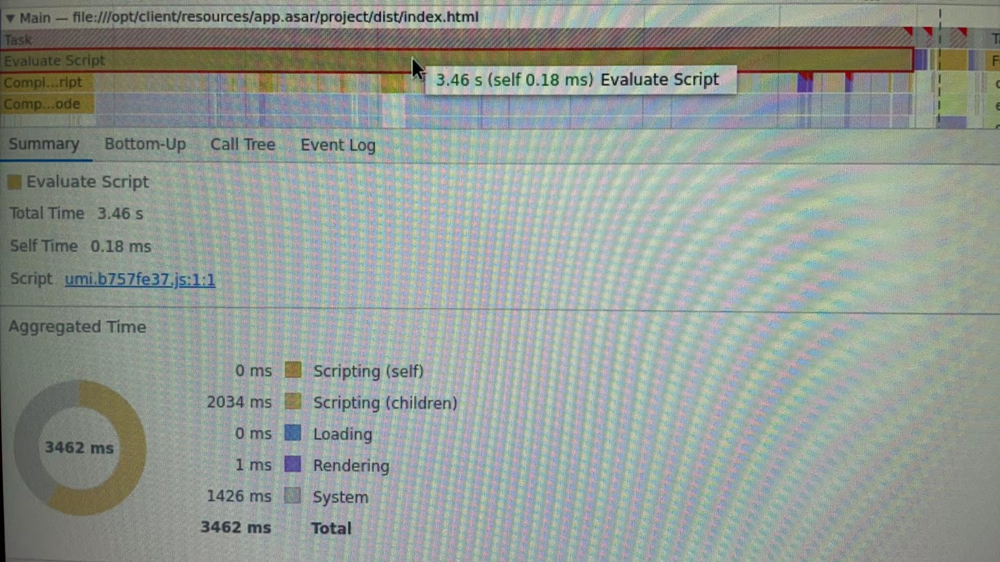
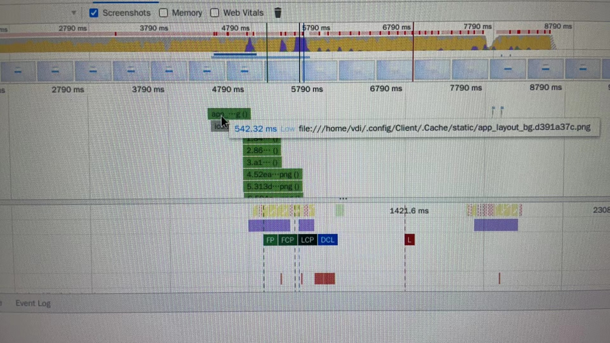
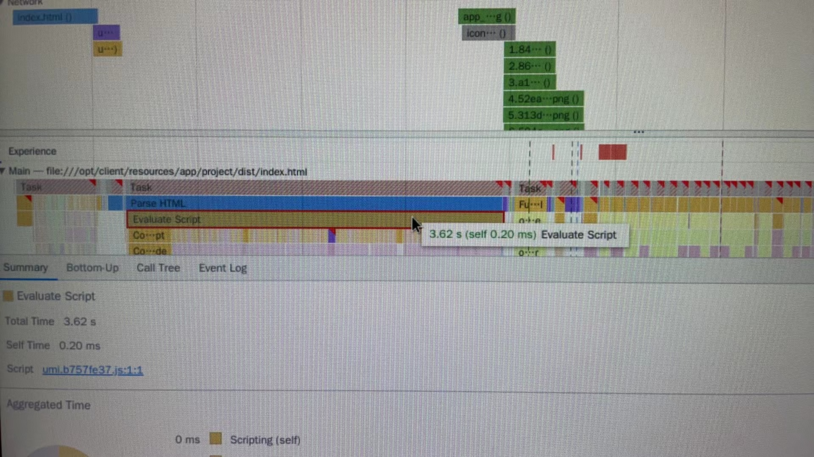

# 记一次RK3568设备上的Electron启动时长分析

## 分析

首先我在RK3568的机器上安装了应用，并打开了Devtool。

然后在Devtool中的Performance页面中操作"Start profiling and reload page"

等待profiling结束之后，可以看到如下界面

通过观察profiling结果，可以发现从1805ms前开始加载页面到7805ms左右完全加载结束，总共用了6秒钟。如果不考虑机器性能，这个时长绝对是用户不能忍受的，那么我们就要分析这6秒钟到底花在了哪里。

从上往下看，首先是Network，Network并不是从页面加载就开始工作的，而是到4305ms之后才开始去加载几张图片，其中最显著的是app_layout_bg这张图片，从4305ms到7805ms，总共加载了3秒钟

从Duration字段中可以看出，加载app_layout_bg这张图片主要的3.44秒都花费在了网络传输中，而加载这张图片仅花费了1.02毫秒。

之后我从Main中查找加载图片之前的时间都在干嘛，很明显的是一个叫Evaluate Script的任务，从页面开始加载，到该任务执行结束，总共使用了3秒钟时间

不难发现他就是umi打包后的大js，脚本化(Scripting)使用了2秒钟时间，执行(System)花费了1秒多的时间。

因此可以确定，在RK3568的设备中，应用启动的主要时间消耗有两方面:  
1. 通过Network从本地加载图片
2. 直接使用了umi打包的大js，没有做分包

## 优化

首先是加载了3秒钟的图片，虽然从分析报告中可以看出是在网络传输中使用了3秒，但通过地址可以看出，这张图片是从asar中获取的，而且我又找了其他几张通过http请求来的图片，并不会消耗这么长时间

所以app_layout_bg这张图片会慢很大可能是Electron解asar包用了很长时间，之后我在这台机器上使用命令行手动解了这个包发现确实需要两三秒的时间，而且因为是本地图片的file://协议，所以Electron也不会对其进行缓存。

那么把所有的静态资源不放在asar里，是不是就会快呢

于是我修改了electron-builder配置，打出来不带asar的包，再跑了一遍分析

可以看到加载app_layout_bg和其他的图片资源所有的时间减少的非常明显

但大js的脚本化和执行时间还是很长，那我们接下来看看怎么给这个umi的大js分包