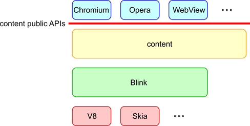
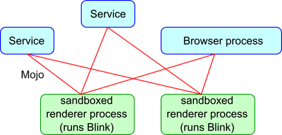
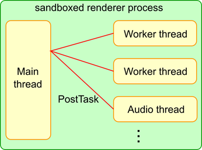
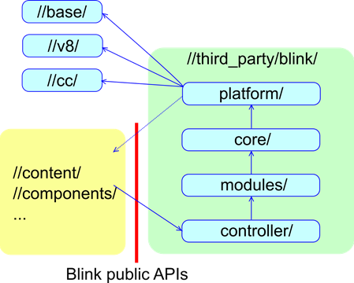
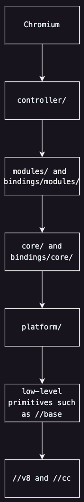
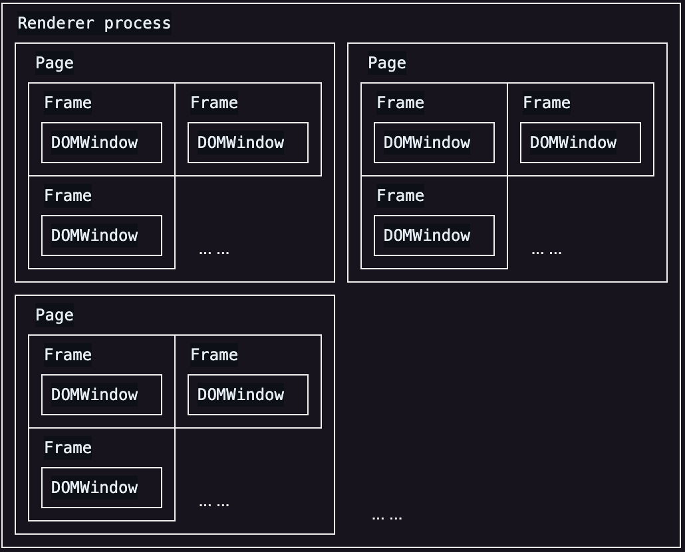
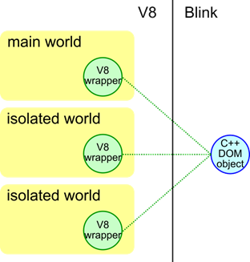
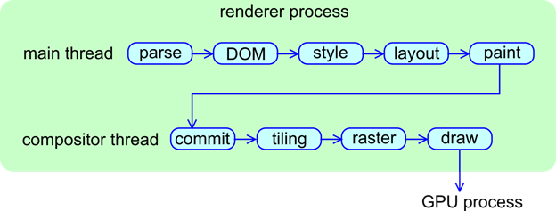

# Chromium中的Blink

## Blink 的作用是什么

Blink是Web平台的渲染引擎。粗略地说，Blink 实现了在浏览器选项卡中呈现内容的所有内容：

* 实现Web平台的规范（例如HTML标准），包括DOM、CSS和Web IDL
* 嵌入 V8 并运行 JavaScript
* 向底层网络堆栈请求资源
* 构建 DOM 树
* 计算样式和布局
* 嵌入Chrome Compositor并绘制图形

Blink 被 Chromium、Android WebView 和 Opera 等许多客户通过内容公共 API嵌入。


从代码库的角度来看，“Blink”通常表示//third_party/blink/。从项目角度来看，“Blink”通常是指实现Web平台功能的项目。实现Web平台功能的代码跨越//third_party/blink/、//content/renderer/、//content/browser/等地方。

## 进程/线程架构

### 进程及进程交互

Chromium 具有多进程架构。 Chromium 有 1 个浏览器进程和 N 个沙盒渲染器进程。 Blink 在渲染器进程中运行。

创建了多少个渲染器进程？出于安全原因，隔离跨站点文档之间的内存地址区域非常重要（这称为站点隔离）。从概念上讲，每个渲染器进程最多应专用于一个站点。但实际上，当用户打开太多选项卡或设备没有足够的 RAM 时，有时将每个渲染器进程限制到单个站点会过于繁重。然后，渲染器进程可以由从不同站点加载的多个 iframe 或选项卡共享。这意味着一个选项卡中的 iframe 可能由不同的渲染器进程托管，并且不同选项卡中的 iframe 可能由同一渲染器进程托管。渲染器进程、 iframe 和 tab 之间不存在 1:1 映射。

鉴于渲染器进程在沙箱中运行，Blink 需要要求浏览器进程调度系统调用（例如，文件访问、播放音频）并访问用户配置文件数据（例如，cookie、密码）。这种浏览器-渲染器进程通信是由Mojo实现的。 （注意：过去我们使用Chromium IPC，很多地方仍在使用它。但是，它已被弃用并在幕后使用 Mojo。）在 Chromium 方面，服务化正在进行中，并将浏览器进程抽象为一组“服务。从 Blink 的角度来看，Blink 只能使用 Mojo 与服务和浏览器进程进行交互。



### 多线程架构

渲染器进程中创建了多少个线程？

Blink 有一个主线程、N 个工作线程和几个内部线程。

几乎所有重要的事情都发生在主线程上。所有 JavaScript（worker 除外）、DOM、CSS、样式和布局计算都在主线程上运行。 Blink 经过高度优化，可最大限度地提高主线程的性能（假设大部分为单线程架构）。

Blink 可以创建多个工作线程来运行Web Workers、ServiceWorker和Worklets。

Blink 和 V8 可能会创建几个内部线程来处理网络音频、数据库、GC 等。

对于跨线程通信，您必须使用 PostTask API 进行消息传递。除了出于性能原因确实需要使用共享内存编程的几个地方之外，不鼓励使用共享内存编程。这就是为什么您在 Blink 代码库中看不到很多 MutexLock。



### Blink 的初始化和结束

Blink 由BlinkInitializer::Initialize()初始化。必须在执行任何 Blink 代码之前调用此方法。

另一方面，渲染器进程被强制退出而不被清理。原因之一是性能。另一个原因是，一般来说，以优雅有序的方式清理渲染器进程中的所有内容确实很困难（而且不值得这么做）。

## 目录结构

### Content中开放的API和Blink中开放的API

Content中开放的 API 是使嵌入者能够嵌入渲染引擎的 API 层。Content 中开放的 API 必须小心维护，因为它们会暴露给嵌入者。

Blink 中开放的 API 是向 Chromium 开放的 //third_party/blink/ 功能的 API 层。这个 API 层只是继承自 WebKit 的历史产物。在 WebKit 时代，Chromium 和 Safari 共享 WebKit 的实现，因此需要 API 层将 WebKit 的功能暴露给 Chromium 和 Safari。现在 Chromium 是 //third_party/blink/ 的唯一嵌入者，API 层就没有意义了。我们正在通过将 Web 平台代码从 Chromium 移至 Blink（该项目称为 Onion Soup）来积极减少 Blink 中开放的 API 的数量。



### 目录结构和依赖关系

//third_party/blink/ 有以下目录。

* platform/
    * 从整个 core/ 中提取的 Blink 较低级别功能的集合。例如，几何和图形实用程序。

* core/ 和 modules/
    * 实施规范中定义的所有网络平台功能。 core/ 实现与 DOM 紧密耦合的功能。 module/ 实现了更多独立的功能。例如，webaudio、indexeddb。

* bindings/core/ 和 bindings/modules/
    * 从概念上讲，bindings/core/ 是 core/ 的一部分，bindings/modules/ 是modules/ 的一部分。大量使用 V8 API 的文件放置在 bindings/{core,modules} 中。

* controller/
    * 一组使用 core/ 和 module/ 的高级库。例如，devtools 前端。

依赖关系按以下顺序流动：

Chromium => controller/ => modules/ and bindings/modules/ => core/ and bindings/core/ => platform/ => low-level primitives such as //base, //v8 and //cc



Blink 需要仔细维护暴露给 //third_party/blink/ 的low-level primitives such。

### WTF

[WTF](https://chromium.googlesource.com/chromium/src/+/master/third_party/blink/renderer/platform/wtf/README.md) 是一个“Blink 特定基础”库，位于 platform/wtf/。我们正在尝试尽可能统一 Chromium 和 Blink 之间的编码原语，所以 WTF 应该很小。之所以需要这个库，是因为有许多类型、容器和宏确实需要针对 Blink 的工作负载和 Oilpan (Blink GC) 进行优化。如果类型是在 WTF 中定义的，Blink 必须使用 WTF 类型而不是 //base 或 std 库中定义的类型。最流行的是向量、哈希集、哈希图和字符串。 Blink 应该使用 WTF::Vector、WTF::HashSet、WTF::HashMap、WTF::String 和 WTF::AtomicString 而不是 std::vector、std::*set、std::*map 和 std::string 。

## 内存管理

就 Blink 而言，您需要关心三个内存分配器：

* [PartitionAlloc](https://chromium.googlesource.com/chromium/src/+/master/base/allocator/partition_allocator/PartitionAlloc.md)
* [Oilpan](https://chromium.googlesource.com/chromium/src/+/master/third_party/blink/renderer/platform/heap/BlinkGCAPIReference.md)（又名 Blink GC）
* malloc（不鼓励）

您可以使用 USING_FAST_MALLOC() 在 PartitionAlloc 堆上分配对象：

```c++
class SomeObject {

  USING_FAST_MALLOC(SomeObject);

  static std::unique_ptr<SomeObject> Create() {

    return std::make_unique<SomeObject>();  // Allocated on PartitionAlloc's heap.

  }

};
```

PartitionAlloc 分配的对象的生命周期应由scoped_refptr<> 或std::unique_ptr<> 管理。强烈建议不要手动管理生命周期。 Blink 中禁止手动删除。

您可以使用 GarbageCollected 在 Oilpan 堆上分配对象：

```c++
class SomeObject : public GarbageCollected<SomeObject> {

  static SomeObject* Create() {

    return new SomeObject;  // Allocated on Oilpan's heap.

  }

};
```

Oilpan 分配的对象的生命周期由垃圾收集自动管理。您必须使用特殊的指针（例如，Member<>、Persistent<>）来保存 Oilpan 堆上的对象。请参阅[Oilpan API 参考](https://chromium.googlesource.com/chromium/src/+/master/third_party/blink/renderer/platform/heap/BlinkGCAPIReference.md)以熟悉有关 Oilpan 的编程限制。最重要的限制是不允许您在 Oilpan 对象的析构函数中触及任何其他 Oilpan 对象（因为无法保证销毁顺序）。

如果既不使用 USING_FAST_MALLOC() 也不使用 GC垃圾回收机制，则对象将在系统 malloc 的堆上分配。 Blink 中强烈建议不要这样做。所有 Blink 对象都应该由 PartitionAlloc 或 Oilpan 分配，如下所示：

* 默认使用 Oilpan
* 仅当 1) 对象的生命周期非常明确并且 std::unique_ptr<> 就足够了，2) 在 Oilpan 上分配对象会带来很多复杂性或 3) 在 Oilpan 上分配对象会带来很多不必要的压力时才使用 PartitionAlloc到垃圾收集运行时。

无论您使用 PartitionAlloc 还是 Oilpan，您都必须非常小心，不要创建悬空指针（注意：强烈建议不要使用原始指针）或内存泄漏。

如果您想了解更多：

* [如何使用PartitionAlloc](https://chromium.googlesource.com/chromium/src/+/master/third_party/blink/renderer/platform/wtf/allocator/Allocator.md)
* [如何使用Oilpan](https://chromium.googlesource.com/chromium/src/+/master/third_party/blink/renderer/platform/heap/BlinkGCAPIReference.md)
* [Oilpan GC 设计](https://chromium.googlesource.com/chromium/src/+/refs/heads/main/third_party/blink/renderer/platform/heap/BlinkGCAPIReference.md)

## 任务调度

为了提高渲染引擎的响应能力，Blink 中的任务应尽可能异步执行。不鼓励同步 IPC / Mojo 和任何其他可能需要几毫秒的操作（尽管有些操作是不可避免的，例如执行用户的 JavaScript 代码）。

渲染器进程中的所有任务都应使用适当的任务类型发布到[Blink Scheduler](https://chromium.googlesource.com/chromium/src/+/HEAD/third_party/blink/renderer/platform/scheduler)，如下所示：

```c++
// Post a task to frame's scheduler with a task type of kNetworking

frame->GetTaskRunner(TaskType::kNetworking)->PostTask(..., WTF::Bind(&Function));
```

Blink Scheduler 维护多个任务队列，并智能地确定任务的优先级，以最大限度地提高用户感知的性能。为了让 Blink Scheduler 正确、智能地调度任务，指定[正确的任务类型](https://cs.chromium.org/chromium/src/third_party/blink/public/platform/task_type.h?q=blink+tasktype&sq=package:chromium&dr=CSs&l=5)非常重要。

如果您想了解更多：

* [如何发布任务](https://chromium.googlesource.com/chromium/src/+/HEAD/third_party/blink/renderer/platform/scheduler/TaskSchedulingInBlink.md)

## 页面、框架、文档、DOMWindow 等

### 概念

Page、Frame、Document、ExecutionContext 和 DOMWindow 是以下概念：

* Page 对应于选项卡的概念（如果未启用下面解释的 OOPIF）。每个渲染器进程可能包含多个选项卡。
* Frame对应于框架（主框架或iframe）的概念。每个页面可以包含一个或多个按树形层次结构排列的框架。
* DOMWindow 对应于 JavaScript 中的 Window 对象。每个 Frame 有一个 DOMWindow。
* Document 对应于 JavaScript 中的 window.document 对象。每个 Frame 都有一个 Document。
* ExecutionContext 是一个抽象 Document（对于主线程）和 WorkerGlobalScope（对于 worker 线程）的概念。

Page、Frame、Document、ExecutionContext 和 DOMWindow 的对应关系：

* Renderer process : Page = 1 : N.
* Page : Frame = 1 : M.
* Frame : DOMWindow : Document (or ExecutionContext) = 1 : 1 : 1



在静态页面中几乎是这样的，但在动态页面中可能会有所变化。例如，考虑以下代码：

```js
iframe.contentWindow.location.href = "https://example.com";
```

在本例中，将为https://example.com创建一个新DOMWindow和一个新Document。然而，Frame可以重复使用。

（注：准确的说，有些情况是创建了一个新的Document，但是重复使用了Window和Frame，还有[更复杂的情况](https://docs.google.com/presentation/d/1pHjF3TNCX--j0ss3SK09pXlVOFK0Cdq6HkMcOzcov1o/edit?pli=1#slide=id.g4983c55b2d55fcc7_42)。）

如果您想了解更多：

* [Frame Code](https://chromium.googlesource.com/chromium/src/third_party/+/refs/heads/main/blink/renderer/core/frame)

### Out-of-Process iframes (OOPIF)

站点隔离使事情变得更加安全，但也更加复杂。 :) 站点隔离的想法是为每个站点创建一个渲染器进程。（站点是页面的可注册域 + 1 标签及其 URL 方案。例如，https://mail.example.com 和 https://chat.example.com 位于同一站点，但 https://oodles.com 和 https://pumpkins.com 则不然。）如果一个页面包含一个跨站点 iframe，则该页面可能由两个渲染器进程托管。考虑以下页面：

```html
<!-- https://example.com -->

<正文>

<iframe src="https://example2.com"></iframe>

</正文>
```

主框架和 \<iframe\> 可以由不同的渲染器进程托管。渲染器进程本地的帧由 LocalFrame 表示，渲染器进程非本地的帧由 RemoteFrame 表示。

从主框架的角度来看，主框架是一个LocalFrame，而\<iframe\>是一个RemoteFrame。从\<iframe\>的角度来看，主框架是RemoteFrame，\<iframe\>是LocalFrame。

LocalFrame 和 RemoteFrame（可能存在于不同的渲染器进程中）之间的通信通过浏览器进程进行处理。

如果您想了解更多：

* 设计文档：[站点隔离设计文档](https://www.chromium.org/developers/design-documents/site-isolation/)
* [如何编写带有站点隔离的代码](https://www.chromium.org/Home/chromium-security/site-isolation/)


### 分离框架/文档

框架/文档可能处于分离状态。考虑以下情况：

```js
doc = iframe.contentDocument;

iframe.remove();  // The iframe is detached from the DOM tree.

doc.createElement("div");  // But you still can run scripts on the detached frame.
```

棘手的事实是，您仍然可以在分离的框架上运行脚本或 DOM 操作。由于框架已经被分离，大多数 DOM 操作都会失败并抛出错误。不幸的是，分离框架上的行为在浏览器之间并不能真正实现互操作，规范中也没有明确定义。基本上期望 JavaScript 应该继续运行，但大多数 DOM 操作应该失败并出现一些适当的异常，如下所示：

```c++
void someDOMOperation(...) {

  if (!script_state_->ContextIsValid()) { // The frame is already detached

    …;  // Set an exception etc

    return;

  }

}
```

这意味着在常见情况下，当框架分离时，Blink 需要执行一系列清理操作。您可以通过继承ContextLifecycleObserver来做到这一点，如下所示：

```c++
class SomeObject : public GarbageCollected<SomeObject>, public ContextLifecycleObserver {

  void ContextDestroyed() override {

    // Do clean-up operations here.

  }

  ~SomeObject() {

    // It's not a good idea to do clean-up operations here because it's too late to do them. Also a destructor is not allowed to touch any other objects on Oilpan's heap.

  }

};
```

## Web IDL 绑定

当JavaScript访问node.firstChild时，node.h中的Node::firstChild()被调用。它是如何工作的？我们来看看node.firstChild是如何工作的。

首先，您需要根据规范定义一个 IDL 文件：

```idl
// node.idl

interface Node : EventTarget {

  [...] readonly attribute Node? firstChild;

};
```

一般情况下就是这样。当您构建node.idl时，IDL编译器会自动为Node接口和Node.firstChild生成Blink-V8绑定。自动生成的绑定在[v8_node.h](https://source.chromium.org/chromium/chromium/src/+/main:out/win-Debug/gen/third_party/blink/renderer/bindings/core/v8/v8_node.h)中生成。当JavaScript调用node.firstChild时，V8调用v8_node.h中的V8Node::firstChildAttributeGetterCallback()，然后调用您在上面定义的Node::firstChild()。

如果您想了解更多：

* [如何添加 Web IDL 绑定](https://chromium.googlesource.com/chromium/src/+/master/third_party/blink/renderer/bindings/IDLCompiler.md)
* [如何使用 IDL 扩展属性](https://chromium.googlesource.com/chromium/src/+/master/third_party/blink/renderer/bindings/IDLExtendedAttributes.md)
* [Web IDL 规范](https://webidl.spec.whatwg.org/)

## V8 和 Blink

### Isolate, Context, World

当您编写涉及 V8 API 的代码时，了解 Isolate、Context 和 World 的概念非常重要。它们在代码库中分别由 v8::Isolate、v8::Context 和 DOMWrapperWorld 表示。

Isolate对应一个物理线程。 Isolate : Blink 中的物理线程 = 1 : 1。主线程有自己的 Isolate。工作线程有自己的隔离区。

Context 对应于一个全局对象（对于 Frame 来说，它是 Frame 的窗口对象）。由于每个帧都有自己的窗口对象，因此渲染器进程中有多个上下文。当您调用 V8 API 时，您必须确保您处于正确的上下文中。否则，v8::Isolate::GetCurrentContext() 将返回错误的上下文，在最坏的情况下，它最终会泄漏对象并导致安全问题。

World是一个支持Chrome扩展脚本的概念。World与网络标准中的任何内容都不对应。扩展脚本想要与网页共享 DOM，但出于安全原因，扩展脚本的 JavaScript 对象必须与网页的 JavaScript 堆隔离。 （此外，一个扩展脚本的 JavaScript 堆必须与另一扩展脚本的 JavaScript 堆隔离。）为了实现隔离，主线程为网页创建一个主 World，并为每个内容脚本创建一个隔离 World。主 World 和隔离 World 可以访问相同的 C++ DOM 对象，但它们的 JavaScript 对象是隔离的。这种隔离是通过为一个 C++ DOM 对象创建多个 V8 包装器来实现的；即每个 World 一个 V8 包装器。



Context、World 和 Frame 之间有什么关系？

想象一下主线程上有 N 个 World（一个主 World + (N - 1) 个 Isolate World）。那么一个 Frame 应该有 N 个 Window 对象，每个 Window 对象用于一个 World。Context 是一个与 Window 对象相对应的概念。这意味着当我们有 M 个帧和 N 个 World 时，我们就有 M * N 个 Context（但 Context 是延迟创建的）。

对于 Worker 来说，只有一个 World 和一个 Global 对象。因此只有一个 Context。

再次强调，当您使用 V8 API 时，您应该非常小心地使用正确的 Context。否则，您最终会在本该相互独立的 World 之间泄漏 JavaScript 对象并导致安全灾难（例如，来自 A.com 的扩展可以操纵来自 B.com 的扩展）。

如果您想了解更多：

[Design of V8 bindings](https://chromium.googlesource.com/chromium/src/+/master/third_party/blink/renderer/bindings/core/v8/V8BindingDesign.md)

### V8 API

[//v8/include/v8.h](https://source.chromium.org/chromium/chromium/src/+/main:v8/include/v8.h)中定义了很多 V8 API 。由于 V8 API 是低级的且难以正确使用，因此[platform/bindings/](https://source.chromium.org/chromium/chromium/src/+/main:third_party/blink/renderer/platform/bindings/)提供了一堆包装 V8 API 的帮助程序类。您应该考虑尽可能多地使用辅助类。如果您的代码必须大量使用 V8 API，则应将文件放置在 bindings/{core,modules} 中。

V8 使用句柄来指向 V8 对象。最常见的句柄是 v8::Local<>，它用于指向机器堆栈中的 V8 对象。在机器堆栈上分配 v8::HandleScope 之后必须使用 v8::Local<>。 v8::Local<> 不应在机器堆栈之外使用：

```c++
void function() {

  v8::HandleScope scope;

  v8::Local<v8::Object> object = ...;  // This is correct.

}

 

class SomeObject : public GarbageCollected<SomeObject> {

  v8::Local<v8::Object> object_;  // This is wrong.

};
```

如果要从机器堆栈外部指向 V8 对象，则需要使用[包装器跟踪（wrapper tracing）](https://chromium.googlesource.com/chromium/src/+/master/third_party/blink/renderer/platform/bindings/TraceWrapperReference.md)。但是，您必须非常小心，不要用它创建引用循环。一般来说，V8 API 很难使用。如果您不确定自己在做什么，请询问[Blink Bindings 的 review 平台](https://groups.google.com/a/chromium.org/g/blink-reviews-bindings)。

### V8 wrappers

每个 C++ DOM 对象（例如 Node）都有其相应的 V8 Wrapper。准确地说，每个 C++ DOM 对象的每个 World 都有其对应的 V8 Wrapper。

V8 Wrapper 对其相应的 C++ DOM 对象具有强引用。然而，C++ DOM 对象只有对 V8 Wrapper 的弱引用。因此，如果您想让 V8 Wrapper 在一段时间内保持活动状态，则必须明确执行此操作。否则，V8 Wrapper 将被过早收集，并且 V8 Wrapper 上的 JS 属性将丢失......

```js
div = document.getElementbyId("div");

child = div.firstChild;

child.foo = "bar";

child = null;

gc();  // If we don't do anything, the V8 wrapper of |firstChild| is collected by the GC.

assert(div.firstChild.foo === "bar");  //...and this will fail.
```

如果我们不采取任何措施，child 就会被 GC 回收，从而 child.foo 就会丢失。为了保持 div.firstChild 的 V8 Wrapper 处于活动状态，我们必须添加一种机制，“只要可以从 V8 访问 div 所属的 DOM 树，就保持 div.firstChild 的 V8 Wrapper 处于活动状态”。

有两种方法可以让 V8 包装器保持活动状态：[ActiveScriptWrappable](https://source.chromium.org/chromium/chromium/src/+/main:third_party/blink/renderer/bindings/core/v8/active_script_wrappable.h)和[包装器跟踪（wrapper tracing）](https://chromium.googlesource.com/chromium/src/+/master/third_party/blink/renderer/platform/bindings/TraceWrapperReference.md)。

## 渲染管线

从 HTML 文件传递​​到 Blink 到像素显示在屏幕上，有一个漫长的过程。渲染管线的架构如下。



阅读[这篇优秀的文章](https://docs.google.com/presentation/d/1boPxbgNrTU0ddsc144rcXayGA_WF53k96imRH8Mp34Y/edit#slide=id.p)，了解渲染管道的每个阶段的作用。

如果您想了解更多：

* [像素的寿命](https://docs.google.com/presentation/d/1boPxbgNrTU0ddsc144rcXayGA_WF53k96imRH8Mp34Y/edit#slide=id.p)
* [DOM](https://chromium.googlesource.com/chromium/src/+/master/third_party/blink/renderer/core/dom/README.md)
* [风格](https://chromium.googlesource.com/chromium/src/+/master/third_party/blink/renderer/core/css/README.md)
* [布局](https://chromium.googlesource.com/chromium/src/+/master/third_party/blink/renderer/core/layout/README.md)
* [绘制](https://chromium.googlesource.com/chromium/src/+/master/third_party/blink/renderer/core/paint/README.md)
* [合成器线程](https://www.chromium.org/developers/design-documents/chromium-graphics/)

## 问题

您可以向[blink-dev@chromium.org](https://groups.google.com/a/chromium.org/g/blink-dev)（针对一般问题）或[platform-architecture-dev@chromium.org](https://groups.google.com/a/chromium.org/g/platform-architecture-dev)（针对架构相关问题）提出任何问题。我们总是很乐意提供帮助！ ：D