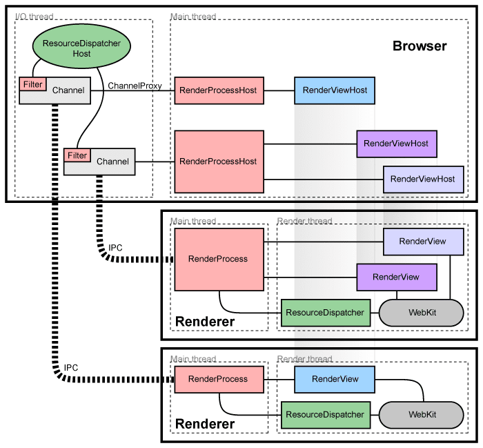

# Chromium多进程分离式架构

## 面对的难题

构建一个从不崩溃或挂起的渲染引擎几乎是不可能的，同样的，构建一个完全安全的渲染引擎也几乎是不可能的。

在某些方面，2006年前后的网络浏览器的状态就像过去的单用户、协同多任务操作系统。在这样的操作系统中，一个行为不端的应用程序可能会导致整个系统崩溃，同样，在浏览器中，一个行为不端的网页也可能会导致整个系统崩溃。只需要一个渲染引擎或插件错误就可以使整个浏览器和所有当前正在运行的选项卡瘫痪。

现代操作系统更加健壮，因为它们将应用程序置于彼此隔离的独立进程中。一个应用程序的崩溃通常不会损害其他应用程序或操作系统的完整性，并且每个用户对其他用户数据的访问都受到限制。Chromium的架构旨在实现这种更健壮的设计。

## 架构概述

Chromium使用多个进程来保护整个应用程序免受渲染引擎或其他组件中的错误和故障的影响。它还限制了每个呈现引擎进程对其他进程和系统其余部分的访问。在某种程度上，这给网页浏览带来了内存保护和访问控制给操作系统带来的好处。

我们将运行UI并管理渲染器和其他进程的主进程称为“浏览器进程”或“浏览器”。同样，处理web内容的进程被称为“渲染进程”或“渲染器”。渲染器使用Blink开源布局引擎来解释和布局HTML。

### 渲染进程的管理

每个渲染进程都有一个全局的 `RenderProcess` 对象，用来管理与父浏览器进程的通信并维护全局状态。浏览器为每个渲染器进程维护一个相应的 `RenderProcessHost` ，它管理渲染器的浏览器状态和通信。浏览器和渲染器使用 [Mojo](https://chromium.googlesource.com/chromium/src/+/HEAD/mojo/README.md) 或 [Chromium的传统IPC系统](https://www.chromium.org/developers/design-documents/inter-process-communication) 进行通信。

### 框架和文档的管理

每个渲染器进程都有一个或多个 `RenderFrame` 对象，这些对象对应于包含内容的文档框架。浏览器进程中相应的 `RenderFrameHost` 管理与该文档相关的状态。每个 `RenderFrame` 都有一个路由ID，用来区分同一渲染器中的多个文档或帧。这些ID在一个渲染器中是唯一的，但在浏览器中不是，所以识别一个帧需要 `RenderProcessHost` 和路由ID。从浏览器到渲染器中特定文档的通信是通过这些 `RenderFrameHost` 对象完成的

## 组件和接口

在渲染进程：

* `RenderProcess` 用来处理在浏览器中与之相关联的 `RenderProcessHost` 的 Mojo 设置和传统 IPC。每个渲染进程只有一个 RenderProcess 对象。

* `RenderFrame` 对象用来与浏览器进程(通过Mojo)和Blink层中与其对应的RenderFrameHost进行通信。这个对象在一个标签或子框架中表示一个web文档的内容。

在浏览器进程：

* `Browser` 对象表示一个顶级浏览器窗口。

* `RenderProcessHost` 对象表示有单个渲染进程IPC连接到了浏览器端。对于每个渲染进程，浏览器进程中都有一个与之对应的RenderProcessHost。

* `RenderFrameHost` 对象封装了与 `RenderFrame` 的通信，`RenderWidgetHost` 在浏览器中处理RenderWidget的输入和绘制。

关于这些部件是如何工作的详细信息，请参阅[Chromium如何显示网页设计文档](https://www.chromium.org/developers/design-documents/displaying-a-web-page-in-chrome)。

## 共享渲染进程

通常，每个新窗口或选项卡在一个新进程中打开。浏览器将生成一个新进程，并指示它创建一个 `RenderFrame`，这可能会在页面中创建更多的iframe(可能在不同的进程中)。

有时，在选项卡或窗口之间共享渲染进程是必要的或可取的。例如，web应用程序可以使用 `window.open` 以创建另一个窗口，如果新文档属于相同的来源，则必须共享相同的进程。如果进程总数太大，Chromium 还具有将新选项卡分配给现有进程的策略。[流程模型](https://chromium.googlesource.com/chromium/src/+/main/docs/process_model_and_site_isolation.md)中描述了这些注意事项和策略。

## 检测崩溃或行为不当的渲染器

假设渲染器在一个单独的进程中运行，我们有机会通过[沙箱](https://chromium.googlesource.com/chromium/src/+/HEAD/docs/design/sandbox.md)限制它对系统资源的访问。例如，我们可以确保渲染器只能通过 Chromium 的网络服务访问网络。同样，我们可以使用主机操作系统的内置权限限制它对文件系统的访问，或者限制它对用户显示和输入的访问。这些限制极大地限制了渲染进程的不当操作。

## 内存回收

由于渲染器运行在不同的进程中，将未激活的选项卡视为较低优先级变得很简单。通常， Windows 上最小化的进程会将其内存自动放入“可用内存”池中。在内存不足的情况下， Windows 会先将这些内存交换到磁盘，然后再交换出优先级更高的内存，这有助于保持用户可见程序的响应速度更快。我们可以将相同的原理应用于未激活的选项卡。当渲染进程没有顶级选项卡时，我们可以释放该进程的“工作集”大小，作为提示系统首先将内存交换到磁盘上。

这有助于我们在低内存情况下获得更优的内存占用。与很少使用的后台选项卡相关的内存可以完全交换出来，而前台选项卡的数据可以完全加载到内存中。相比之下，单进程浏览器将所有选项卡的数据随机分布在其内存中，并且不可能如此干净地分离使用和未使用的数据，从而浪费内存和性能。

## 额外的进程类型

Chromium 还将许多其他组件拆分为单独的进程，有时采用特定于平台的方式。例如，现在有一个独立的GPU进程、网络服务和存储服务。沙盒实用程序进程也可以用于小型或有风险的任务，作为满足安全性 [The Rule Of 2](https://chromium.googlesource.com/chromium/src/+/master/docs/security/rule-of-2.md) 的一种方法。